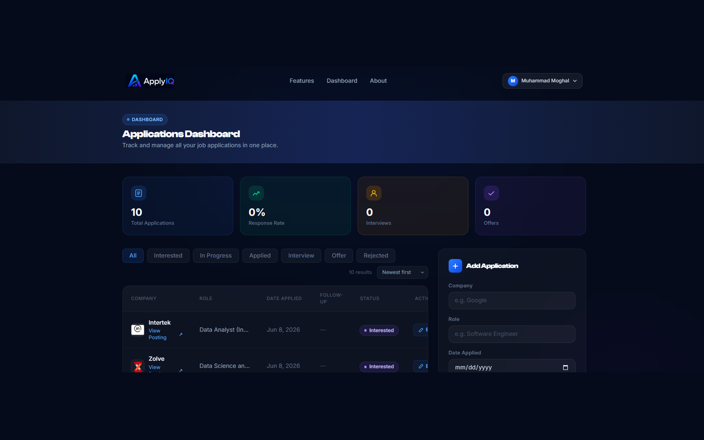
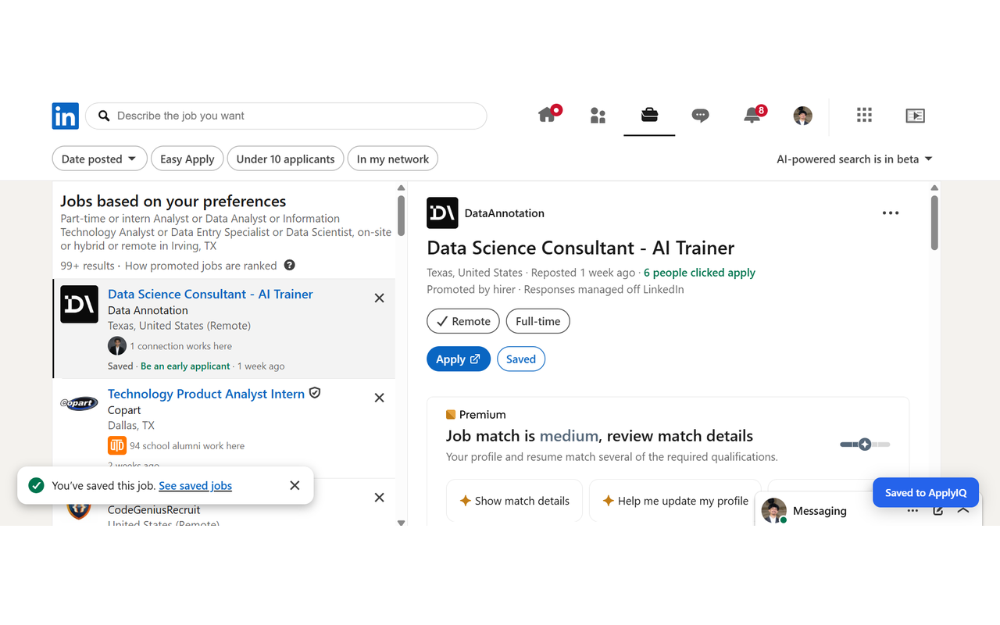
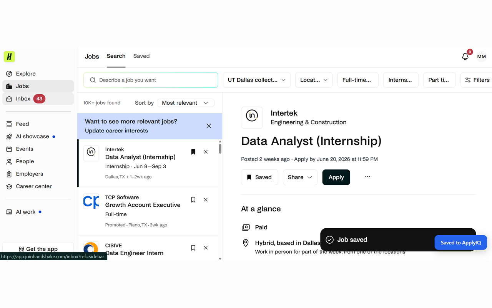

# ApplyIQ

ApplyIQ is a full-stack job application tracking platform that helps job seekers organize applications, monitor progress, and streamline their job search workflow. Users can track opportunities in a centralized dashboard and save jobs directly from LinkedIn and Handshake using the ApplyIQ Chrome Extension.

## Live Demo

**Website:** https://applyiq-pi.vercel.app

**Chrome Extension:** Submitted for Chrome Web Store review.

---

## Key Features

### Application Tracking Dashboard

* Track applications by company, role, location, status, application date, and notes
* Manage the entire job search pipeline in one place
* Edit, update, filter, sort, and delete applications
* Monitor progress through customizable application statuses

### Analytics & Insights

* Total Applications tracking
* Response Rate monitoring
* Interview tracking
* Offer tracking
* Pipeline visibility across all application stages

### Chrome Extension Integration

* Save jobs directly from LinkedIn with one click
* Save jobs directly from Handshake with one click
* Automatically capture job details
* Sync saved jobs directly into the ApplyIQ dashboard
* Real-time save and removal notifications

### Authentication & Security

* Google OAuth authentication
* Secure user-specific data access
* Supabase Row-Level Security (RLS)
* Protected dashboard routes

---

## Tech Stack

### Frontend

* Next.js
* React
* TypeScript
* Tailwind CSS

### Backend & Database

* Supabase
* PostgreSQL
* Supabase Authentication
* Row-Level Security (RLS)

### Deployment

* Vercel

### Browser Extension

* Chrome Extension (Manifest V3)
* Content Scripts
* Chrome Storage API

---

## Architecture

ApplyIQ consists of two integrated products:

### 1. Web Application

The main dashboard where users:

* Manage applications
* Track progress
* View analytics
* Organize job search activity

### 2. Chrome Extension

The browser extension:

* Detects supported LinkedIn and Handshake job pages
* Extracts job information
* Sends jobs directly to the user's ApplyIQ account
* Provides instant save/remove feedback

---

## Current Status

### Completed

* Application tracking dashboard
* Google Authentication
* Supabase integration
* Status management system
* LinkedIn job saving
* Handshake job saving
* Dashboard analytics
* Privacy Policy page
* Terms of Service page
* Chrome Web Store submission

### In Development

* Gmail application import
* AI-powered job search insights
* Resume recommendations
* Interview preparation insights
* Enhanced analytics

---

## Future Roadmap

* Gmail integration
* AI-generated job search recommendations
* Automated application tracking
* Resume optimization suggestions
* Interview preparation tools
* Advanced analytics dashboard
* Mobile responsiveness improvements

---

## Screenshots

### Dashboard

### LinkedIn Integration

### Handshake Integration

---

## Author

**Muhammad Moghal**

Information Systems Student | Data Analytics & Full-Stack Development

ApplyIQ was built to simplify job application tracking and eliminate the need for spreadsheets during the internship and full-time job search process.
